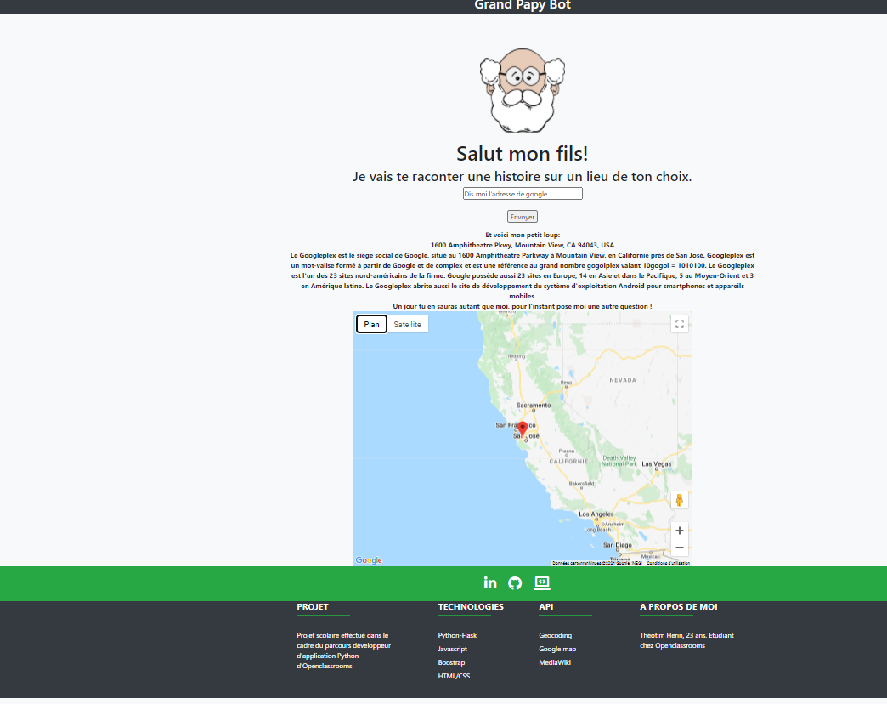

  
  

# Website

This website was done for a school project with Openclassrooms. 

## Website link
 [Grand papy bot](https://grand-papy-bot-th.herokuapp.com/)

## Usage

You must enter a location.
For exemple: ("Dis moi l'adresse de la tour eiffel")
The grandfather will answer you the address, the map and a story.

## Local installation:

Install libraries cmd: "pip install riquirements.txt"
Activate Interpreter cmd: "venv\Scripts\activate.bat activate"
